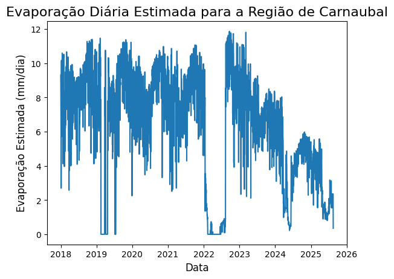

# Fase 3: Pivô para um Modelo Analítico - Cálculo da Evaporação

## Objetivo da Fase 3
A análise da Fase 2 demonstrou que um modelo preditivo para a `variacao_volume` era inviável devido à ausência de dados cruciais de consumo e aporte. O objetivo da Fase 3 foi, portanto, mudar a abordagem: em vez de *prever* uma variável ruidosa, decidimos *calcular* uma de suas componentes mais importantes e estáveis, a **evaporação**.

A nova pergunta científica do projeto tornou-se:
> **"Qual é a taxa de evaporação diária estimada para a região do Açude Carnaubal, e como ela varia ao longo do tempo?"**

## Metodologia: O Modelo Analítico

Para responder a esta pergunta, trocamos o Machine Learning por um **modelo analítico baseado na física**, utilizando os dados de clima que já haviam sido tratados.

* **Abordagem:** Implementação em Python de uma fórmula que converte a energia da radiação solar em uma lâmina de água evaporada.
* **Fórmula:** `Evaporação (mm/dia) = Radiação Solar Total Diária (MJ/m²/dia) * 0.408`
    * O coeficiente `0.408` é um fator de conversão padrão recomendado pela **Organização das Nações Unidas para a Alimentação e a Agricultura (FAO)**, que converte a energia em megajoules para milímetros de evapotranspiração equivalente.

## Processo Técnico
1.  **Agregação de Dados:** Os dados horários do INMET foram agregados para uma base diária. Para cada dia, foram calculadas a temperatura máxima, mínima e média, e a **soma total da radiação global**.
2.  **Conversão de Unidades:** A radiação global total, originalmente em Quilojoules (Kj), foi convertida para Megajoules (MJ).
3.  **Aplicação da Fórmula:** A função de conversão foi aplicada a cada dia do nosso dataset de clima, gerando uma nova série temporal: `evaporacao_estimada_mm`.

## Resultados Finais

O resultado final do projeto é um gráfico que mostra a evaporação diária estimada para a região de Carnaubal entre 2018 e 2025.

### Análise dos Resultados e Insights
* **Valores Realistas:** A taxa de evaporação calculada ficou na faixa de 0 a 12 mm/dia, o que é fisicamente consistente com o esperado para a região semiárida.
* **Padrão Sazonal Claro:** O gráfico revela um forte padrão sazonal, com picos de evaporação (maior perda de água) ocorrendo consistentemente no segundo semestre de cada ano, durante a estação seca (período conhecido como "B-R-O-Bró").
* **Vales Sazonais:** Os vales de evaporação ocorrem no primeiro semestre, coincidindo com a quadra chuvosa, período de maior nebulosidade e menor radiação solar.

## Conclusão do Projeto
O pivô de uma abordagem preditiva para uma analítica foi a decisão-chave para o sucesso do projeto. Em vez de produzir um modelo de IA com performance ruim devido a dados faltantes, o projeto entregou um resultado cientificamente robusto e com insights valiosos sobre o comportamento de uma variável climática crítica para a gestão hídrica.

Este projeto demonstra o ciclo completo de uma investigação em ciência de dados: da formulação de uma hipótese, passando pela depuração de modelos, até a reavaliação da estratégia com base nas evidências para chegar a uma conclusão sólida e útil.

---
---

## English Version

# Phase 3: Pivot to an Analytical Model - Evaporation Calculation

## Objective of Phase 3
The analysis from Phase 2 demonstrated that a predictive model for `variacao_volume` was unfeasible due to the lack of crucial consumption and inflow data. The objective of Phase 3 was, therefore, to shift the approach: instead of *predicting* a noisy variable, we decided to *calculate* one of its most important and stable components, **evaporation**.

The project's new scientific question became:
> **"What is the estimated daily evaporation rate for the Carnaubal Reservoir region, and how does it vary over time?"**

## Methodology: The Analytical Model

To answer this question, we replaced the Machine Learning approach with a **physics-based analytical model**, using the climate data that had already been processed.

* **Approach:** Implementation in Python of a formula that converts solar radiation energy into a layer of evaporated water.
* **Formula:** `Evaporation (mm/day) = Total Daily Solar Radiation (MJ/m²/day) * 0.408`
    * The coefficient `0.408` is a standard conversion factor recommended by the **Food and Agriculture Organization of the United Nations (FAO)**, which converts energy in megajoules to an equivalent evapotranspiration depth in millimeters.

## Technical Process
1.  **Data Aggregation:** The hourly data from INMET was aggregated to a daily basis. For each day, the maximum, minimum, and mean temperatures were calculated, along with the **total sum of global radiation**.
2.  **Unit Conversion:** The total global radiation, originally in Kilojoules (Kj), was converted to Megajoules (MJ).
3.  **Formula Application:** The conversion function was applied to each day in our climate dataset, generating a new time series: `evaporacao_estimada_mm`.

## Final Results

The final output of the project is a plot showing the estimated daily evaporation for the Carnaubal region from 2018 to 2025.

### Results Analysis and Insights
* **Realistic Values:** The calculated evaporation rate fell within the range of 0 to 12 mm/day, which is physically consistent with expectations for the semi-arid region.
* **Clear Seasonal Pattern:** The plot reveals a strong seasonal pattern, with evaporation peaks (higher water loss) consistently occurring in the second half of each year, during the dry season (a period locally known as "B-R-O-Bró").
* **Seasonal Lows:** The lowest evaporation rates occur in the first half of the year, coinciding with the rainy season, a period of greater cloud cover and lower solar radiation.

## Project Conclusion
Pivoting from a predictive to an analytical approach was the key decision for the project's success. Instead of producing an AI model with poor performance due to missing data, the project delivered a scientifically robust result with valuable insights into the behavior of a critical climate variable for water management.

This project demonstrates the complete cycle of a data science investigation: from formulating a hypothesis and debugging models to re-evaluating the strategy based on evidence to arrive at a solid and useful conclusion.